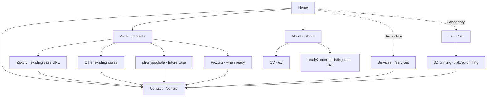

# Portfolio redesign — sitemap, content map and page outlines

Date: 2026-09-21
Status: Task 1 structural recommendation, ready for review. Implements the approved
strategy at the planning level; new pages and URL behaviour are not built yet.

Related: [Discovery brief](./2026-09-20-portfolio-redesign-brief.md),
[audit evidence](./2026-09-21-portfolio-experience-audit.md),
[staged roadmap](./2026-09-21-portfolio-redesign-roadmap.md).

## Structural recommendation

Use a short, work-led homepage and a consistent navigation layer across all public
pages. Give About and Contact their own routes. Keep the existing `/projects` URL
while naming it Work. Move the calculator into Lab. Preserve existing case-study
and CV URLs so the redesign can happen incrementally.

The cinematic quality comes from composition, visual storytelling, transitions
and interaction. Essential information remains directly reachable through normal
links and natural scrolling. The following is a content sequence, not a finished
wireframe or a mandate for identical section rectangles.

## Proposed sitemap

All internal routes below carry the existing EN/PL locale prefix.

Solid lines show intended visitor paths, not technical route nesting. Contact is
also available globally. The logo/name returns Home. Work, About and Contact are
primary; Services and Lab are secondary but visibly discoverable through a menu
or footer. Theme and locale controls retain their utility role. Final navigation
placement, appearance and motion belong to Task 2.

**Why separate About from CV:** About can explain fit, judgment and collaboration
in the portfolio's visual language. The CV remains a concise, printable document
for someone actively evaluating experience.

**Why a Contact route:** A standalone destination is easy to reach from a case,
Services, a shared link or a direct visit. Its form and feedback can be designed
without requiring the full homepage journey. The homepage still ends with an
invitation and visible email, linking to the same form.

## Three journeys to protect

| Visitor                         | Main route                         | Useful alternatives                     | End state                                                                 |
| ------------------------------- | ---------------------------------- | --------------------------------------- | ------------------------------------------------------------------------- |
| Business owner or agency        | Home → selected case → Contact     | Work → case; Services → proof → Contact | Understands fit, work quality and investment context; can send an enquiry |
| Hiring manager or contract lead | About → CV / ready2order → Contact | Direct CV or role-case entry            | Can assess contribution and experience, then discuss a role               |
| Experiment or printing visitor  | Lab → 3D printing → Contact        | Old calculator anchor → new tool        | Can explore/use the tool and optionally request a print quote             |

No journey requires returning Home to find a next step. Every case has an explicit
All work route. Browser Back should restore the previous useful state and should
not replay an obligatory opening sequence. Transitions must tolerate interruption.

## Page outlines

### Home — establish character, show work, create intent

1. **Opening scene.** The recognizable blob, typography and motion establish the
   identity. One plain sentence explains the offer and who it helps. “Explore work”
   leads directly to visible projects; Contact is already available in navigation.
2. **Selected work.** Begin with Zakofy and a strong customer-led image or motion
   scene. Each selection has its name, a brief reason to care and a direct case
   link. Use two or three convincing selections when assets justify them; never
   fill an empty slot with a fictional or unfinished result.
3. **Capabilities and fit.** Briefly connect the work to complete website delivery,
   digital products and specialist frontend collaboration, in that priority order.
   Link to Services for detail. Avoid a second package catalogue.
4. **Personal context.** A short statement of how Sebastian works and relevant
   experience; optional small portrait. Link to About/CV. No process photography.
5. **Enquiry ending.** A direct invitation, restrained approved investment guidance,
   link to Contact and visible email. Secondary links can include Lab and the local
   subbrand where they are useful.

Editorial budget to test: one idea per text block, usually one to three sentences.
Let scenes alternate visual discovery with short explanations. A full paragraph
should earn its place by answering a visitor's question. Do not enforce a pixel
height or make every scene occupy a complete viewport.

### Work — choose a project without learning an interface

Open with visible project imagery and short descriptors. Every selection directly
opens a case. Keep enough text to distinguish the work and Sebastian's contribution.
Avoid filter controls until the collection actually needs them.

Zakofy leads the first prototype. Existing projects remain reachable as supporting
work. Present ready2order clearly as employment/team work, also linked from About.
Promote stronypodhale after its venture story and assets are prepared. Piczura can
take flagship placement when completed and documented; it is not a launch blocker.

Cursor previews, scene changes and other discoveries can enrich selection, but
the initial image, project identity and link must work on touch and keyboard too.

### Case study — make the customer's result tangible

1. **Project scene:** client identity, a deliberate visual, one-sentence context.
   Keep the portfolio's navigation legible and separate from UI depicted in media.
2. **At a glance:** client, engagement type, accurate contribution and date. Keep
   the stack secondary. “Freelance” belongs under engagement, not client identity.
3. **The need:** a short explanation of the customer's situation and desired change.
4. **Two or three decisions:** alternate imagery or short interaction captures with
   the important decisions and their consequences. Show what changed rather than
   repeating generic Challenge/Approach/Solution prose.
5. **The finished experience:** evidence across devices, selected detail views and
   a live-site link where available. Only show supported outcomes and attributed
   customer feedback. Qualitative results are valid when numbers are unavailable.
6. **Ending:** relevant invitation → Contact, followed by optional next work.

Customer colors, photography and composition can shape each scene. Portfolio
navigation, type roles, spacing logic and motion behaviour provide continuity.
Use the blob at chosen entrances, transitions or endings; decide its choreography
through the connected prototype rather than adding it to every image.

Zakofy is the first content-production task. Record exact authorship, collaborators,
approved client assets and evidence before final copy. Distinct mobile crops and
captures are deliverables, not last-minute desktop-image substitutions.

### About — explain the person through relevant experience

Lead with a concise account of Sebastian's role, approach and collaboration style.
Use selected work and a small amount of career evidence to support it. Include
location and international collaboration context without narrowing the portfolio
to local business services. Show a compact experience outline with links to CV and
ready2order. End with project/collaboration contact options.

The portrait is optional and supporting. Generic philosophy essays, repeated stack
lists and a second full CV do not need to live here.

### Services — clarify fit and expectations

Order the offer as complete websites, broader digital products, then specialist
frontend support. Explain what the client gets and the kind of engagement it suits.
Tie each substantial claim to relevant work. Show a short delivery outline and
only FAQs that resolve genuine uncertainty.

Present the approved starting investment or typical range near the enquiry, with
scope and assumptions. Existing prices are audit facts, not approval of future
pricing. Do not invent new amounts or promise outcomes without evidence.

Describe stronypodhale as Sebastian's dedicated offering for local businesses where
appropriate, with an external link. Avoid a rigid brand barrier or a default
discount comparison. End at Contact.

### Contact — make the next step clear and easy

Use one short form: name, email and project/message description required; budget
and timing optional. Keep direct email visible and usable independently. Put
approved investment guidance close to the form, clearly scoped to website projects.
Employment and print enquiries should not appear subject to a website minimum.

An optional context choice or an incoming link can identify a website, agency/
contract, employment or print enquiry. Do not require an extra selection before
typing. Any prefilled context must remain visible and editable. Final behaviour
belongs to the form implementation brief.

Specify empty, validation, submitting, success and delivery-failure states. Preserve
input on recoverable errors and offer email as a fallback. Do not claim a response
time until it is agreed. Keep social profiles secondary. Provider, spam handling,
privacy copy and measurement are implementation dependencies, not design blockers.

### Lab and 3D printing — give exploration a deliberate home

Lab introduces experiments through useful visuals and plain descriptions. Start
with the real calculator; a small collection is acceptable. Do not create placeholder
projects to make the page look larger.

The printing page explains the experiment, presents its interactive estimator and
keeps the estimate assumptions and optional quote action nearby. Its controls and
result must be understandable on phone without relying on cursor effects. Preserve
the existing calculation behaviour while relocating it. Quote links take the
visitor to Contact with a clear print context; don't add a separate hidden form.

### CV — maintain a useful document

Keep the existing URL and printable structure. Retain accurate experience,
credentials, direct contact and selected relevant project links. Use the shared
site shell on screen, with print-specific output that omits navigation. Validate
the actual print/PDF result in its own task. Reserve room for utility controls at
tablet widths. No need to stretch the document to fill ultrawide screens.

## Content disposition

| Existing content                               | Action                    | Destination / rationale                                                           |
| ---------------------------------------------- | ------------------------- | --------------------------------------------------------------------------------- |
| Blob, typography, cursor and motion identity   | Keep and refine           | Shared expressive system, tested across the full journey                          |
| Hero title and technical introduction          | Reframe and shorten       | Home: immediately explain the preferred offer                                     |
| Long About / philosophy / technical SEO blocks | Condense and redistribute | About and relevant Services/case detail; remove repetition after editorial review |
| Portrait and personal facts                    | De-emphasize              | Optional About image; short Home context                                          |
| Repeated technology chips                      | Reduce prominence         | Secondary case details and CV                                                     |
| Homepage project accordion                     | Replace presentation      | Immediately visible selections with direct links                                  |
| Full project book                              | Reconsider interaction    | Direct visual Work index; retain suitable expressive ideas in prototypes          |
| Case-study galleries                           | Promote and interleave    | Visual evidence throughout the story                                              |
| Generic project narratives and metrics         | Verify and rewrite        | Project-specific contributions and supported outcomes                             |
| Homepage packages and workflow                 | Summarize                 | Brief capabilities on Home; fuller expectations on Services                       |
| Full Services page                             | Keep route, restructure   | Preferred engagement order, proof, concise expectations and FAQ                   |
| Date-sensitive availability                    | Update or omit            | Publish only wording that can be kept current                                     |
| Local-brand price comparison                   | Reframe                   | Explain stronypodhale's audience and offering                                     |
| Homepage calculator                            | Relocate intact           | Lab / 3D printing; retain optional quote route                                    |
| Large equal-weight social links                | De-emphasize              | Contact/footer after primary enquiry and email                                    |
| CV and ready2order                             | Keep                      | Support employment/contract evaluation through About                              |
| Internal design preview                        | Keep internal             | Supporting development resource, outside public sitemap/navigation                |

## URL and anchor compatibility

| URL or anchor                                         | Proposed treatment                                                                                           |
| ----------------------------------------------------- | ------------------------------------------------------------------------------------------------------------ |
| `/`, `/en`, `/pl`                                     | Preserve current root/default-locale behaviour                                                               |
| `/{locale}/projects` and every existing case slug     | Preserve; change navigation label to Work without a URL rename                                               |
| `/{locale}/services`, `/{locale}/cv`                  | Preserve and refine incrementally                                                                            |
| New `/about`, `/contact`, `/lab`, `/lab/3d-printing`  | Add under each locale only when ready; do not publish dead navigation links                                  |
| Future `/projects/stronypodhale`, `/projects/piczura` | Working slug proposals; publish only with prepared cases                                                     |
| Home `#hero`, `#projects`                             | Preserve meaningful intro/work targets                                                                       |
| Home `#about`, `#services`, `#contact`                | Preserve concise section targets with links to the fuller route                                              |
| Home `#calculator`                                    | When relocating, preserve a compact bridge/link to the Lab tool; verify actual inbound usage before retiring |
| Skip target                                           | Preserve a functioning skip-to-main destination                                                              |
| `/design`                                             | Keep internal/noindex; remove from public sitemap in maintenance work                                        |
| Sitemaps, locale alternates, metadata                 | Update when real pages ship; preserve current infrastructure endpoints                                       |

Fragments are not sent to the server, so a server redirect cannot distinguish
`/#calculator` from the homepage. A retained meaningful target avoids introducing
automatic client redirects solely for old fragments. Audit analytics and known
links before any later removal. No current page is scheduled for deletion.

## Five-format composition contract

| Format                        | What the design must establish                                                                                                                                |
| ----------------------------- | ------------------------------------------------------------------------------------------------------------------------------------------------------------- |
| Phone · 390 × 844             | Work arrives early; readable type and deliberate crops; visible navigation labels; form and calculator usable with touch; no mandatory hover discovery        |
| Landscape tablet · 1024 × 768 | Layout respects short height; navigation never overlaps titles/utilities; imagery visible before interaction; no assumption that this width means mouse input |
| Laptop · 1440 × 900           | Images and explanatory text share space intentionally; entry and ending actions stay clear; motion doesn't delay ordinary navigation                          |
| Desktop · 1920 × 1080         | Composed visual scenes with bounded prose; deliberate rhythm between scale and detail; consistent chrome across page types                                    |
| Ultrawide · 3440 × 1440       | Wider visual composition where useful, bounded reading/form widths; no accidental empty intermediate states; UI remains discoverable across the full width    |

Task 2 must show the same opening, project scene and enquiry composition at all
five sizes. Intermediate widths, short heights, Polish copy, both themes, keyboard,
touch and reduced motion remain required before implementation acceptance. The
five snapshots alone do not establish responsiveness or accessibility.

## Handoff to the next bounded tasks

Task 1 now supplies a current-route inventory, evidence, content dispositions,
explicit client/employer/Lab paths and a recommended page structure. Its boundary
remains planning only.

**Task 2 next:** Compare two or three visual treatments within this structure. Each
must include Home, a Zakofy scene and the Contact destination, with motion notes
and five-format compositions. Compare identity continuity, prominence of work,
customer expression and ease of navigation. Do not spend the task designing every
remaining page or inventing final copy.

**Task 3:** Prepare the Zakofy contribution/story/assets so Task 4's connected
prototype uses credible material. Piczura remains independent of this dependency.

Still open at the appropriate stage: exact visual treatment and motion timing;
asset selection and client permissions; evidence for outcomes; investment amounts;
form delivery implementation; actual analytics/performance baselines. These are
bounded follow-ups, not reasons to reopen the agreed audience and identity choices.
